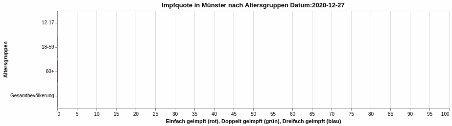

## Welcome to my Page

#Covid 19

[Inzidenzen in Münster aufgeschlüsselt nach Altersgruppen](Inzidenzen_Altergruppen.html)  
Quelle: [semohr/risikogebiete](https://github.com/semohr/risikogebiete_deutschland)

[Impfquote in Münster aufgeschlüsselt nach Altersgruppen](ImpfQuoteMuenster.html)  
Quelle: Robert Koch-Institut (2021): COVID-19-Impfungen in Deutschland, Berlin: Zenodo. [DOI:10.5281/zenodo.5126652](http://doi.org/10.5281/zenodo.5126652).

